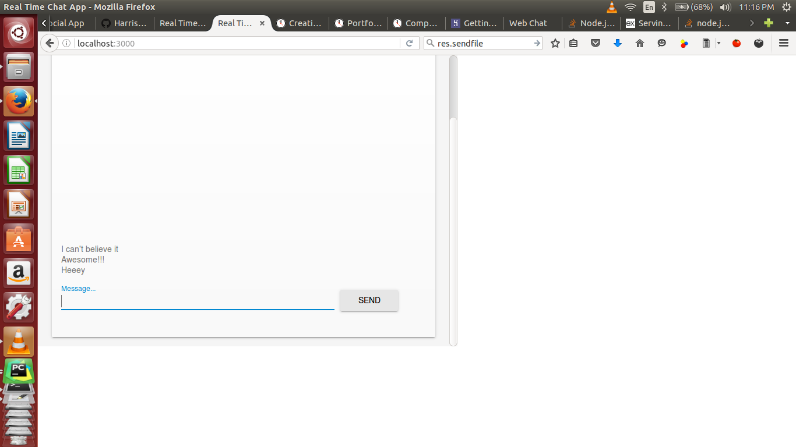
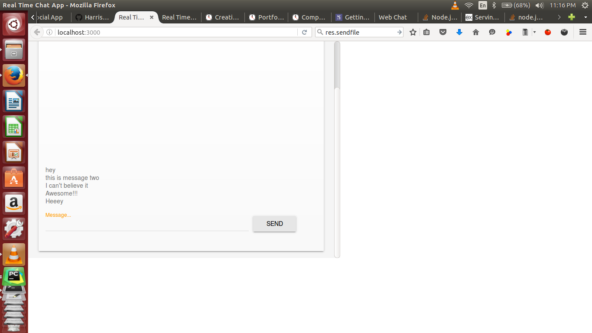

<h1>Real Time Chat App</h1>

The chat app displays two users messages

Opening the chat link in a new tab will display the current conversation

The app has been built using <a href="https://nodejs.org/en/ "/>Node.js</a>, <a href="https://expressjs.com/" />Express.js</a> and <a href="http://socket.io" />Socket.io</a> technologies

<h3>See the screenshots below</h3>

